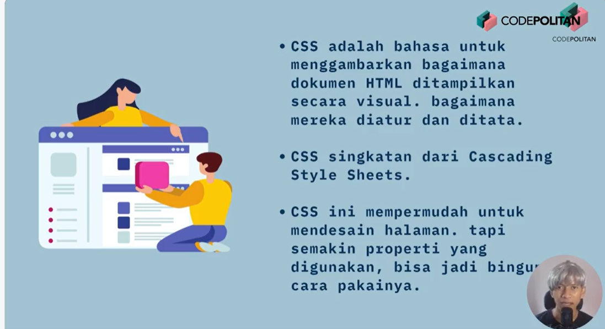
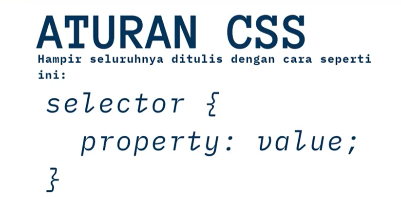
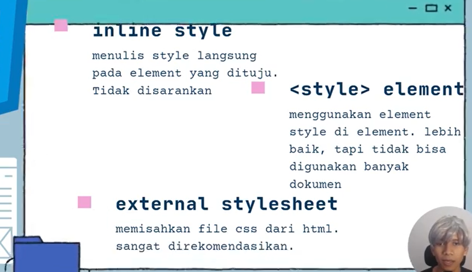
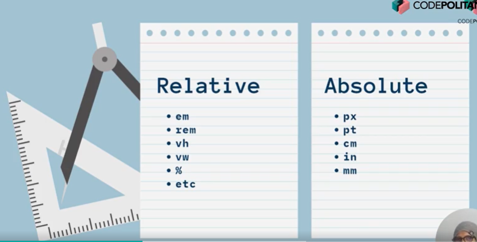

## CSS (Cascading Style Sheet)





##### Inline

di setiap element

```CSS
<button
        style="
          background-color: blue;
          color: white;
          padding: 5px;
          padding-left: 15px;
          padding-right: 15px;
        "
      >
        Klik
      </button>
```

##### Style Element

di Head,

```CSS
 <style>
      button {
        background-color: blue;
        color: white;
        padding: 5px;
        padding-left: 15px;
        padding-right: 15px;
      }
    </style>
```

> **Inline dan Style element tidak direkomendasikan karena akan memenuhi file html.
> Best Pratice Gunakan perinsip separation concern, buat file css sendiri kemudian masukkan linknya ke html**

---

### Sistem Warna

- RGB
- Hex
- Named color
  referensi cari warna:
  [https://htmlcolorcodes.com]()
  [https://cssgradient.io]()

### Text Properti

- text-align : alignmen dari text/paragraf
- font-weight : ketebalan text dri 100-900. 400-600 normal
- text-decoration : untuk memberikan variasi pada text atau menghilangkan default style misal pd anchor
- line-height : Spasi antar baris
- letter-spacing : memberikan jarak antar huruf

---

### Ukuran pada CSS


