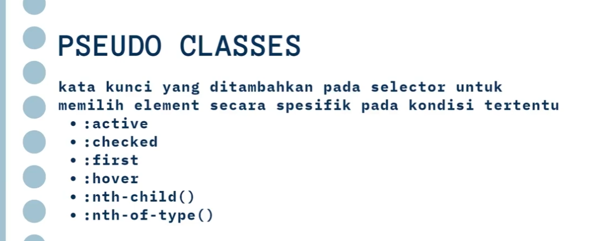

## CSS (Cascading Style Sheet)


##### Inline

di setiap element

```CSS
<button
        style="
          background-color: blue;
          color: white;
          padding: 5px;
          padding-left: 15px;
          padding-right: 15px;
        "
      >
        Klik
      </button>
```

##### Style Element

di Head,

```CSS
 <style>
      button {
        background-color: blue;
        color: white;
        padding: 5px;
        padding-left: 15px;
        padding-right: 15px;
      }
    </style>
```

> **Inline dan Style element tidak direkomendasikan karena akan memenuhi file html.
> Best Pratice Gunakan perinsip separation concern, buat file css sendiri kemudian masukkan linknya ke html**

---

### Sistem Warna

- RGB
- Hex
- Named color
  referensi cari warna:
  [https://htmlcolorcodes.com]()
  [https://cssgradient.io]()

### Text Properti

- text-align : alignmen dari text/paragraf
- font-weight : ketebalan text dri 100-900. 400-600 normal
- text-decoration : untuk memberikan variasi pada text atau menghilangkan default style misal pd anchor
- line-height : Spasi antar baris
- letter-spacing : memberikan jarak antar huruf

---

### Ukuran pada CSS


### Selector

#### Elemen HTML

```CSS
h1, h2, h3 {
  color :white;
  background-color: black
}
```

#### Attribute ID

```CSS
#ganjil {
  color :white;
  background-color: black
}
```

#### Elemen Class

```CSS
.card {
  color :aquamarine
  background-color: green
}
```

#### Class vs ID

> Class: Used for styling multiple elements, reusable components, utility classes, and JavaScript event handling for groups of elements.
> ID: Used for unique element styling, JavaScript manipulation of a single element, creating anchor links, and associating form labels with inputs.

#### Descendant Selector

Menseleksi elemen yang ada setelah elemen yg lain, tidak harus persis sebelum atau setelahnya.
Misal seluruh elemen p di dalam class card. tpi p yg berada di .card>div>p tetap akan terselect. Jadi tidak harus tepat urut 1 level.

```CSS
.search p {
  font-weight: 400;
  font-size: larger;
  font-family: monospace;
}
```

#### Direct Descendant dan Ajdacent Selector

- Direct Descendant --> spesifik elemen yg harus tepat setelah elemen yg lain

```CSS
.search > p {
  font-family: "Segoe UI", Tahoma, Geneva, Verdana, sans-serif;
  font-weight: 200;
  margin: 0rem;
  padding: 0rem;
}
```

- Ajdacent --> element tepat sebelum sibling/samping elemen tertentu. Jadi tepat tidak ke semua. select an element that is immediately preceded by a specified sibling element
  Misal button yg berada tepat setelah anchor tag:

```HTML
<article>
  <a href="#">I dont know anything</a>
  <button>+</button>
</article>
```

```CSS
a + button {
  font-family: "Segoe UI", Tahoma, Geneva, Verdana, sans-serif;
  font-weight: 800;
  font-size: 18px;
  margin: 0rem;
  padding: 0rem;
  padding-left: 0.3rem;
  padding-right: 0.3rem;
  background: linear-gradient(
    90deg,
    rgba(67, 217, 138, 1) 2%,
    rgba(0, 212, 255, 1) 100%
  );
}
```

### Attribute Selector

Melakukan seleksi berdasarkan attribut elemen

contoh semua text yg ada dalam input yg bertipe text,dapat juga menggunakan wildcard,

```CSS
input[type='text']{
  color :red;
}
/* <a> elements with an href containing "example" */
a[href*="example"] {
  font-size: 2em;
}
```

lebih lengkap cek [disini](https://developer.mozilla.org/en-US/docs/Web/CSS/Attribute_selectors)

### Pseudo Classes


ada banyak sekali pseudo class ini, cek [disini](https://developer.mozilla.org/en-US/docs/Web/CSS/Pseudo-classes#tree-structural_pseudo-classes)
contoh [nth-child](https://developer.mozilla.org/en-US/docs/Web/CSS/:nth-child):

```CSS
tbody tr:nth-child(2n){
        background-color: cadetblue;
      }
```

### Pseudo elements


untuk seleksi elemen
misal untuk huruf pertama di setiap paragraf di dalam tag article

```CSS
article p::first-letter {
  color: rgb(1, 97, 121);
  font-size: xx-large;
}
```

### BOX MODEL


Setiap elemen dari html/block adalah kotak. Dan di kotak tersebut terdapat padding, margin, dan konten itu sendiri.

- [padding](https://developer.mozilla.org/en-US/docs/Web/CSS/padding) = > jarak konten dengan border dalam
- [margin](https://developer.mozilla.org/en-US/docs/Web/CSS/margin) = > jarak border luar dengan konten lain

#### Border

style, ukuran, warna

```CSS
div {
  border-style: dashed dotted solid double;
  border-width: 5px 10px 15px 20px;
  border-color: red blue yellow green;
}
```

### Display

Jadi elemen secara default ada yang inline dan block elemen. berikut lengkapnya dari docs
[Block Element | Inline Element] (https://www.w3schools.com/html/html_blocks.asp)
