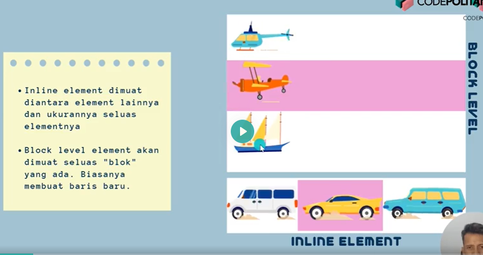
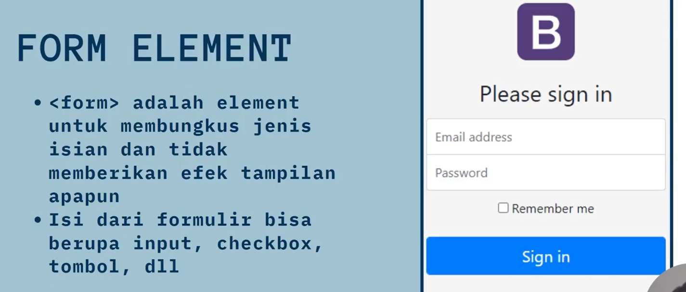
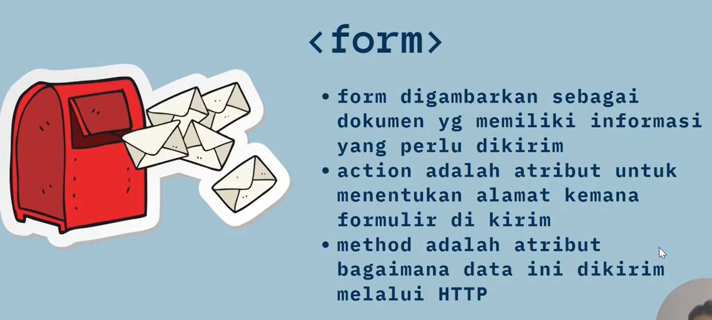

- div for wrapping component/items together
- Gunakan semantic element agar lebih mudah dibaca baik oleh search engiine maupun developer

### Display

Display ada yang block dan ada yg inline. Block berarti space akan terblok dan elemen selanjutnya ada dibawahnya sedangkan inline hanya menggunakan space sebesar elemen itu dan bisa lsg dilanjutkan elemen selanjutnya


- Gunakan colspan untuk merge columns dan rowspan untuk merge baris. Ingat, buat dulu mau berapa baris dan kolom baru lakukan merge

### Form element




## Button dalam Form

secara default button dalam form akan jadi submit button, agar menjadi button biasa bisa specify type nya button atau pakai input tapi typenya button

```html
<button type="button">Button Biasa</button>
<input type="button" value="Input type Button" />
<button type="submit">Submit</button>
```

### Method pada Form

- GET, sesuai dengan attribute name maka data isian akan muncul sebagai query params.
  http://127.0.0.1:5500/submit?username=ssfsdf&email=sugengdatascience%40gmail.com&password=sdsdfs

-POST, tidak akan muncul di query params tapi di network formdata akan masih muncul.

> Gunakan sesuai kebutuhan, untuk cridential atau data yg rahasia lebih baik pakai post. Sebaliknya jika agar user tau di halaman/filter apa dan ketika dishare hasilnya sama maka pakai get
