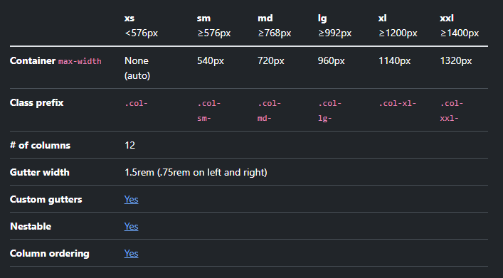

### Install

- tambahkan rel/link ke CSS..bisa pake CDN
- tambahkan JS juga, set defer. Jadi kalau ada CSS yg pakai JS udah bisa

---

### Container

Sistem untuk mengatur tampilan responsive sesuai ukuran layar
Containers are a fundamental building block of Bootstrap that contain, pad, and align your content within a given device or viewport.
Bootstrap comes with three different containers:

- .container, which sets a max-width at each responsive breakpoint
- .container-{breakpoint}, which is width: 100% until the specified breakpoint
- .container-fluid, which is width: 100% at all breakpoints
  [More here](https://getbootstrap.com/docs/5.3/layout/containers/)

---

### Button & Button Group

[docs](https://getbootstrap.com/docs/5.3/components/buttons/)

---

#### Alert, Badge, Notification, Spinner

---

### Grid Sistem

- jadi dalm bootstrap luasan dibagi dalam 12 unit
- gunakan breakpoint dlm hal ini pakai Min Width shg col-md : berlaku ketika screen ukuran medium keatas, col-lg:berlaku ketika screen large keatas
  Use our powerful mobile-first flexbox grid to build layouts of all shapes and sizes thanks to a twelve column system, six default responsive tiers, Sass variables and mixins, and dozens of predefined classes.
  

  [More](https://getbootstrap.com/docs/5.3/layout/grid/)

### Utilities

Sangat berguna untuk menambahkan style sesuai keinhginan sehingga tidak component based tetapi bisa dikombinasikan sesuai keinginan
[more](https://getbootstrap.com/docs/5.3/utilities/flex/)

### Form

[more](https://getbootstrap.com/docs/5.3/forms/overview/)
